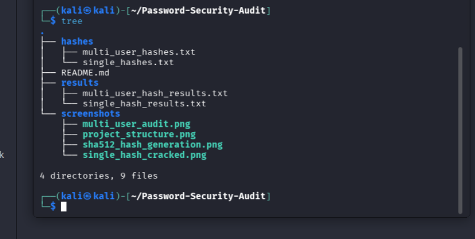
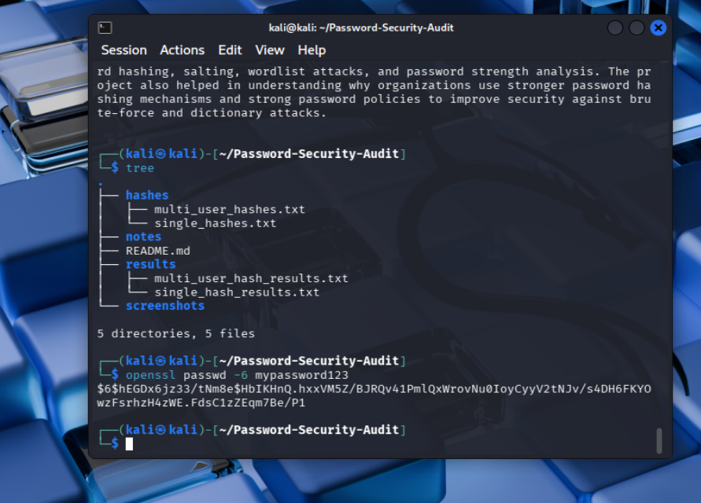
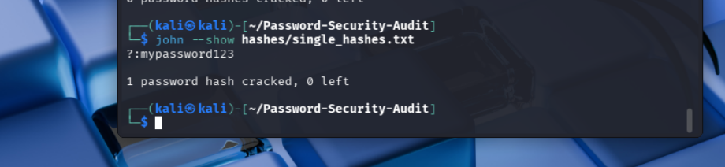

# Password Security Audit using John the Ripper

## Project Overview

This project was done to understand how password auditing works in cybersecurity using John the Ripper on Kali Linux.

In this project, password hashes were generated using OpenSSL with SHA-512 hashing and tested using wordlist-based password auditing techniques. The project also covers important concepts like hashing, salting, password strength, rule-based attacks, mask attacks, and modern password hashing algorithms.

The main goal of this project was to learn how weak passwords can be identified and why strong password policies are important in real-world systems.

## Objectives

- Understand how password hashes work
- Learn password auditing using John the Ripper
- Perform wordlist-based password testing
- Understand salting and SHA-512 hashing
- Analyze password strength using practical examples
- Learn the basics of rule-based and mask attacks theoretically
- Understand modern password hashing algorithms like bcrypt, scrypt, and Argon2

## Tools Used

- Kali Linux
- John the Ripper
- OpenSSL
- RockYou Wordlist
- Nano Text Editor
- VMware Workstation

## Project Structure

## Project Structure

```text
Password-Security-Audit
├── hashes
│   ├── multi_user_hashes.txt
│   └── single_hashes.txt
│
├── results
│   ├── multi_user_hash_results.txt
│   └── single_hash_results.txt
│
├── screenshots
│   ├── multi_user_audit.png
│   ├── project_structure.png
│   ├── sha512_hash_generation.png
│   └── single_hash_cracked.png
│
└── README.md
```


## Project Workflow

1. Created a project folder structure for storing hashes, results, notes, and screenshots.

2. Generated password hashes using OpenSSL with SHA-512 hashing algorithm.

3. Stored generated hashes inside text files for testing with John the Ripper.

4. Installed and verified John the Ripper tool in Kali Linux.

5. Used RockYou wordlist to perform password auditing on generated hashes.

6. Tested single user and multi-user hash files separately

7. Analyzed password cracking results to understand password strength.

8. Studied how salting protects passwords even when users use same passwords.

9. Learned theoretical concepts of rule-based attacks and mask attacks.

10. Understood why modern organizations use stronger password hashing algorithms like bcrypt, scrypt, and Argon2.


## Commands Used

### Generate SHA-512 Hash

openssl passwd -6 mypassword123


### Install John the Ripper

sudo apt update

sudo apt install john -y


### Verify John Installation

john


### View Available Wordlists

ls /usr/share/wordlists


### Extract RockYou Wordlist

sudo gzip -d /usr/share/wordlists/rockyou.txt.gz


### Crack Single Hash

john --wordlist=/usr/share/wordlists/rockyou.txt single_hashes.txt


### View Cracked Passwords

john --show single_hashes.txt


### Crack Multi User Hash File

john --wordlist=/usr/share/wordlists/rockyou.txt multi_user_hashes.txt


### Rule-Based Attack

john --wordlist=/usr/share/wordlists/rockyou.txt --rules multi_user_hashes.txt


### Mask-Based Attack

john --mask='?u?l?l?l?l?s?d?d?d' multi_user_hashes.txt


### Mask Symbols

?u = Uppercase letter

?l = Lowercase letter

?d = Digit

?s = Symbol

?a = All character sets


### Export Results

john --show single_hashes.txt > ../results/single_hash_results.txt


## Key Learnings

- Learned how password hashing works in operating systems and applications.
- Understood difference between hashing and encryption.
- Learned importance of salting in password protection.
- Understood how attackers use wordlists for password cracking.
- Practically used John the Ripper for password auditing.
- Learned why weak passwords can be cracked quickly.
- Understood why strong passwords increase attack time.
- Learned theoretical concepts of rule-based attacks and mask-based attacks.
- Understood limitations of fast hashing algorithms like SHA-256 and SHA-512 for password storage.
- Learned why modern organizations prefer bcrypt, scrypt, and Argon2 for password security.


## Security Recommendations

- Use passwords with minimum 12 to 16 characters.
- Use combination of uppercase, lowercase, numbers, and symbols.
- Avoid common passwords available in public wordlists.
- Enable Multi-Factor Authentication (MFA).
- Use strong password hashing algorithms like bcrypt, scrypt, or Argon2.
- Enable account lockout after multiple failed login attempts.
- Regularly audit password strength in enterprise environments.
- Avoid password reuse across multiple accounts.


## Conclusion

This project helped in understanding practical password auditing concepts using John the Ripper in Kali Linux. It provided hands-on experience with password hashing, salting, wordlist attacks, and password strength analysis. The project also helped in understanding why organizations use stronger password hashing mechanisms and strong password policies to improve security against brute-force and dictionary attacks.


## Screenshots

### Project Structure




### SHA-512 Hash Generation




### Single Hash Password Audit




### Multi User Password Audit


## Git Workflow Used

```bash
git init
git add .
git commit -m "Initial commit"
git branch -M main
git remote add origin <repository-url>
git push -u origin main
```

## Repository Purpose

This repository was created for:

- Practical cybersecurity learning
- Password auditing practice
- Understanding password hashing concepts
- Hands-on Kali Linux experience
- GitHub portfolio demonstration
- Interview preparation


## Author

Surendra Gorle

Cybersecurity Enthusiast | Cryptography Learner | Python Security Projects

GitHub:
https://github.com/SurendraGorle


